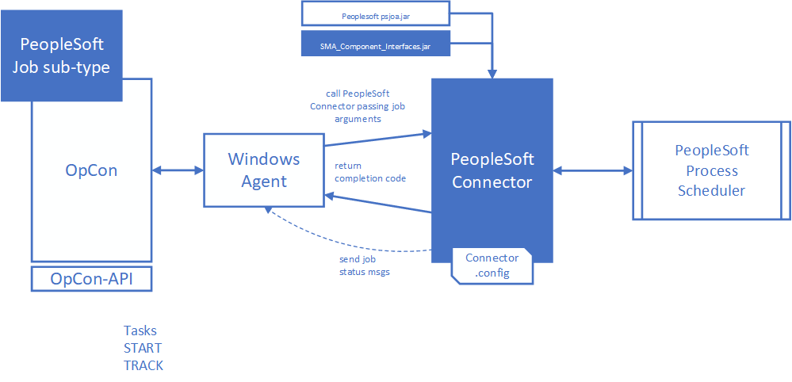

# SMA PeopleSoft Connector

The PeopleSoft Connector can be used to Start or Monitor running batch jobs within the PeopleTools Process Scheduler. 
The connector interacts with the Process Scheduler to start or monitor running PeopleSoft batch processes.  

The SMA OpCon PeopleSoft Connector consists of a Windows batch program that is executed by the Windows Agent. It includes a Java 
library SMA_Component_Interfaces.jar developed within the PeopleSoft environment that provides access to the PeopleSoft Process Table 
and the PeopleSoft Tools jar (psjoa.jar) that provides the connectivity components allowing the connector to communicate with the 
PeopleTools Process Scheduler. 

The job definitions entered within the SMA OpCon environment, indicate which PeopleSoft batch process defined within the PeopleTools 
Process Scheduler to either start or monitor. 

The job definitions are entered as Windows jobs using the PeopleSoft job sub-type. When the job is scheduled by OpCon, the job definitions 
are passed as arguments to the PeopleSoft Connector.

During the job processing, if configured the status of the PeopleSoft job can be displayed in the OpCon List view.

The connector returns the PeopleSoft batch process completion code to OpCon where it can be used to determine if the process completed successfully.

---