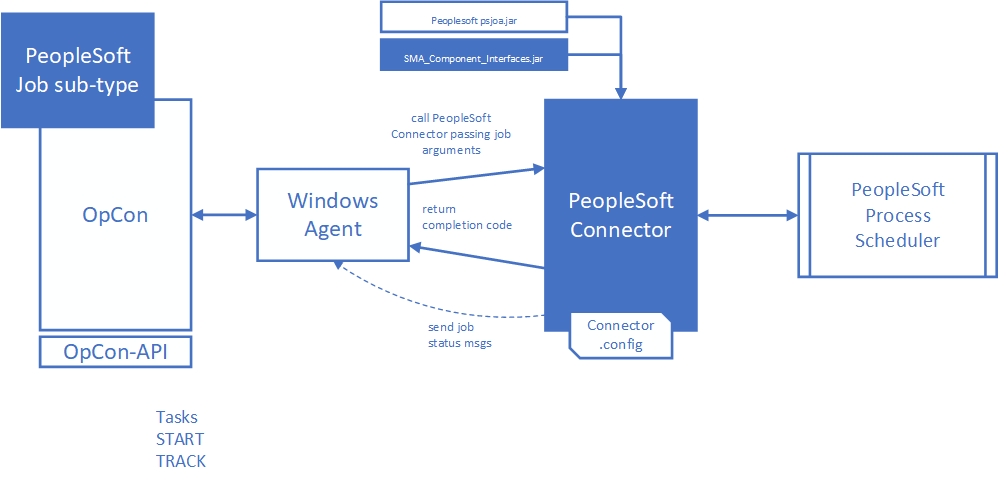

# SMA PeopleSoft Connector

## What is it?

The PeopleSoft Connector is an SMA OpCon component that starts and monitors PeopleSoft batch processes through the PeopleTools Process Scheduler. The connector lets you schedule and track existing PeopleSoft jobs from OpCon without creating new job definitions in the PeopleSoft database.

The SMA OpCon PeopleSoft Connector consists of a Windows batch program that runs under the Windows Agent. It includes a Java library (`SMA_Component_Interfaces.jar`) developed within the PeopleSoft environment that provides access to the PeopleSoft Process Table, and the PeopleSoft Tools jar (`psjoa.jar`) that provides the connectivity components allowing the connector to communicate with the PeopleTools Process Scheduler.

## How it works

The job definitions entered within the SMA OpCon environment indicate which PeopleSoft batch process defined within the PeopleTools Process Scheduler to either start or monitor.

The job definitions are entered as Windows jobs using the PeopleSoft job sub-type. When the job is scheduled by OpCon, the job definitions are passed as arguments to the PeopleSoft Connector.

During job processing, if configured, the status of the PeopleSoft job can be displayed in the OpCon List view.

The connector returns the PeopleSoft batch process completion code to OpCon where it can be used to determine if the process completed successfully.

## Glossary

> **PeopleTools Process Scheduler** — The PeopleSoft component that manages and runs batch processes within the PeopleSoft environment.

> **Process Type** — The category of PeopleSoft batch process, such as Application Engine, COBOL SQL, Crystal, PSJob, or SQR Report.

> **Process Name** — The identifier of the specific batch process defined in the Process Scheduler.

> **Run Control ID** — A grouping value associated with a PeopleSoft user name. It is used by PeopleSoft to associate runtime parameters with a process.

> **Connector Path** — A global property in OpCon that contains the full path to the PeopleSoft Connector installation directory. The default property name is `PeopleSoftPath`.

> **Job Type (START/TRACK)** — Two PeopleSoft job behaviors supported by the connector. **START** starts a defined PeopleSoft job and tracks it to completion. **TRACK** tracks a PeopleSoft job already started by the Process Scheduler to completion.

> **psjoa.jar** — The PeopleSoft Tools jar that provides connectivity components allowing the connector to communicate with the Process Scheduler.

> **SMA_Component_Interfaces.jar** — The Java library developed within the PeopleSoft environment that provides access to the PeopleSoft Process Table.
